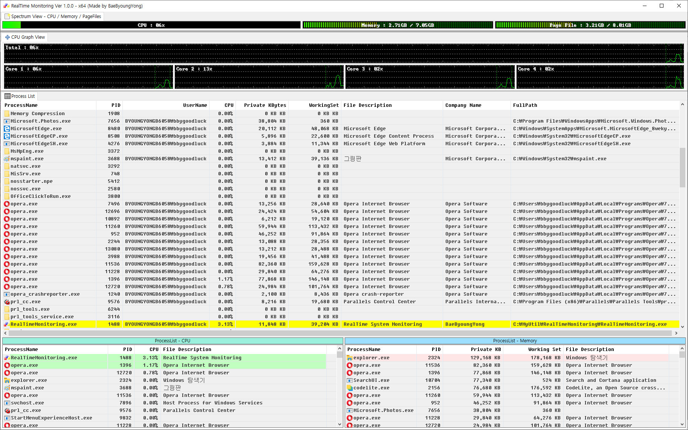

# RealTimeMonitoring

- ## The RealTimeMonitoring is simple realtime system monitoring tool

## Development Envorinment

- Compiler : gcc 10.0
- IDE : CodeLite 14.0
- GUI Library : wxWidgets 3.1.3

## ScreenShot

